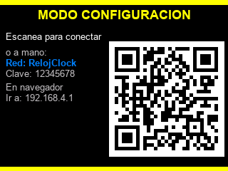
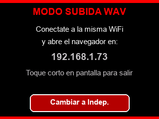

# Manual de uso — Reloj Multiclock

Este reloj tiene dos modos:

- **Modo F1**: muestra la hora y la cuenta regresiva a la próxima sesión de Fórmula 1 (clasificación, carrera, etc.).
- **Modo Independiente**: muestra la hora y la cuenta regresiva al próximo partido de Independiente o de la Selección Argentina (el que esté más cerca).

## Configurar el WiFi

El reloj intenta conectarse solo a las redes que ya conoce. Si no logra conectarse a ninguna (por ejemplo, mudaste de casa o cambiaste la contraseña del router), automáticamente crea su propia red WiFi para que lo configures, y muestra esta pantalla:

1. En el celular, buscá la red WiFi llamada **"RelojClock"** y conectate con la contraseña **"12345678"**.
2. Abrí el navegador y entrá a **192.168.4.1**.
3. Vas a ver un formulario simple: cargá el nombre (SSID) y la contraseña de tu WiFi real.
4. Guardá — el reloj reinicia solo y se conecta a la red nueva.

Si no configurás nada en unos minutos y el reloj ya tenía la hora sincronizada alguna vez antes, sigue funcionando offline con su reloj interno (aunque sin los datos de partidos/carreras actualizados).

## Controlar el volumen

El reloj suena cada una hora en punto (por ejemplo 9:00, 10:00, 11:00...), solo en horario diurno (entre las 9:00 y las 22:00). Fuera de ese rango se mantiene en silencio automáticamente, sin que tengas que hacer nada.

Si igual querés controlar el volumen de esos sonidos (por ejemplo bajarlo de noche temprano, o silenciarlo del todo), tocá la pantalla brevemente (un toque corto). Cada toque cicla entre:

**Mute → Volumen bajo → Volumen normal → Mute...**

## Cambiar entre modo F1 e Independiente

Hay dos formas:

### Opción 1: Desde la pantalla del reloj
1. Mantené el dedo apoyado en la pantalla unos **3 segundos** (toque largo).
2. Va a aparecer una pantalla que dice "MODO SUBIDA" con una dirección IP y un botón para cambiar de modo:

   

3. Tocá el botón que dice **"Cambiar a F1"** o **"Cambiar a Indep."** (el texto cambia según el modo actual).
4. El reloj reinicia solo y arranca en el modo nuevo.

Si entraste por error a esa pantalla y no querés cambiar nada, tocá brevemente en cualquier lado para salir sin hacer cambios.

### Opción 2: Desde el celular/PC
1. Hacé el toque largo (3 segundos) como en la Opción 1, para que se abra el servidor.
2. Conectate a la **misma red WiFi** que el reloj.
3. Abrí el navegador y entrá a la dirección IP que muestra la pantalla del reloj.
4. Tocá el botón **"Cambiar a F1"** / **"Cambiar a Independiente"**.

## Brillo de la pantalla

Se ajusta solo, automáticamente, según la luz del ambiente. No requiere ninguna acción.

## Actualizaciones

De vez en cuando, al encender el reloj (desenchufar y enchufar), puede aparecer un cartel de **"NUEVA VERSION"** con una cuenta regresiva de 10 segundos. Necesita WiFi para poder chequear y bajar la actualización.

**Importante**: para que la actualización se descargue e instale, tenés que **tocar la pantalla** en esos 10 segundos. Si no la tocás, el reloj se lo salta y sigue funcionando normal con la versión que ya tenía (no se rompe nada, simplemente no queda actualizado hasta la próxima vez que encienda y vuelvas a tocar la pantalla a tiempo).

## Tips generales

- Si el reloj queda sin WiFi por mucho tiempo, mantiene la hora gracias a una batería de respaldo interna, aunque los datos de partidos/carreras dejan de actualizarse hasta que vuelva a tener conexión.
- Evitá desenchufar el reloj justo cuando aparece el cartel de actualización o la pantalla de "MODO SUBIDA" — dejalo terminar el proceso.
